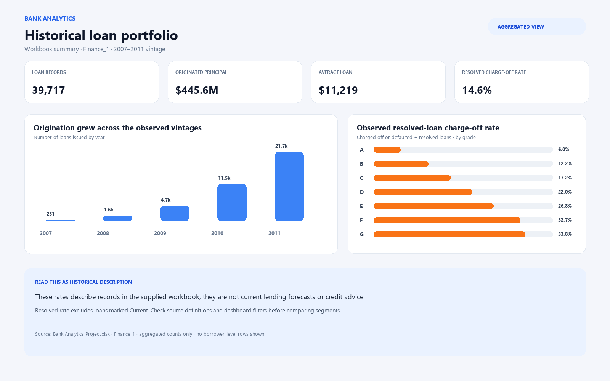

# Bank Analytics

An exploratory loan-portfolio analytics project built with MySQL, Excel, Power BI, and Tableau. It examines origination trends, loan outcomes, risk segments, borrower attributes, and recorded payment activity in a historical dataset.

## Project files

- [`Bank Analytics Project.xlsx`](Bank%20Analytics%20Project.xlsx) — source workbook with the `Finance_1` and `finance_2` data sheets plus workbook analyses.
- [`SQL.sql`](SQL.sql) — MySQL 8+ data checks and portfolio analysis queries.
- [`PowerBI Project_.pbix`](PowerBI%20Project_.pbix) — interactive Power BI dashboard.
- [`Tableau.twbx`](Tableau.twbx) — packaged Tableau workbook.

The Excel workbook is stored with Git LFS. Install Git LFS before cloning if you need the full workbook file.

## Run the SQL analysis

1. Import the `Finance_1` and `finance_2` worksheets into a MySQL database named `excelr`, preserving the sheet names as table names.
2. Confirm that both tables contain a unique `id` column and that date fields such as `issue_d` were imported as dates.
3. Open `SQL.sql` in MySQL Workbench and run the queries. The first queries report row counts, unique IDs, and join coverage before the portfolio summaries.

The script is read-only apart from selecting the `excelr` database. If your local database or column names differ, update the `USE` statement or field references to match your import.

## Analysis included

- Annual loan counts, originated principal, and average loan size.
- Portfolio outcome counts and shares of loans and principal.
- Observed charge-off/default rates by grade, term, and state.
- Revolving balances by grade and sub-grade.
- Recorded payment totals by verification status and payment components by outcome.

## Preview

This aggregated preview is generated from the `Finance_1` workbook data. It shows portfolio-level counts and rates, not a captured Power BI or Tableau screen, and contains no borrower-level rows.

The resolved-loan rate queries count only rows labeled fully paid, charged off, or defaulted. Current, late, and other unresolved statuses are excluded from that denominator. The state comparison excludes groups with fewer than 100 resolved loans to reduce noise in small samples.

## Interpretation limits

This is a historical, observational dataset. These summaries describe the records supplied; they do not establish that a borrower attribute causes a loan outcome, predict current lending performance, or recommend a credit decision. Portfolio composition, missing data, status definitions, and vintage effects can all change comparisons. Review the source data and dashboard filters before drawing conclusions.
